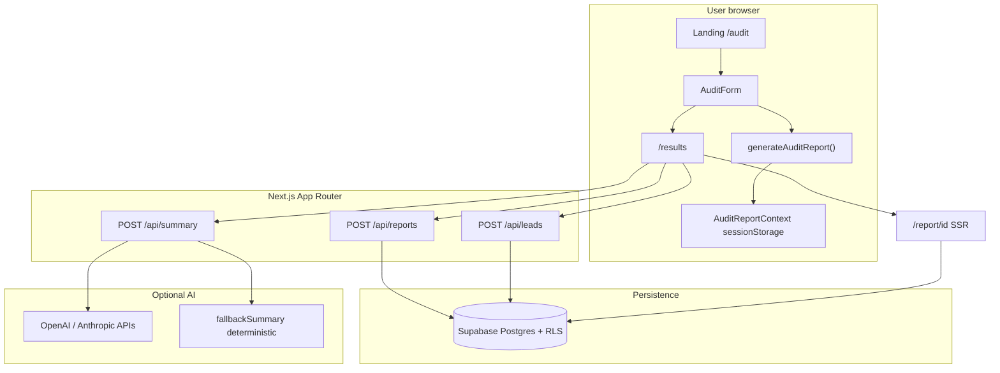

# Architecture

This document describes AuditAI’s system architecture, end-to-end data flow, technology choices, deterministic engine behavior, AI isolation, scaling posture, and lightweight abuse protections.

---

## System diagram (Mermaid)

**Data flow (user input → audit result):**

1. User enters team context and tool rows on `/audit`.
2. Client runs `generateAuditReport(input)` (`lib/audit/engine.ts`): pure rules, no network.
3. Result is stored in React context (`contexts/AuditReportContext.tsx`, session-scoped).
4. `/results` shows recommendations, triggers `POST /api/reports` once (idempotent client guards), then optional `POST /api/summary`, then optional `POST /api/leads`.
5. Public share URL reads the row server-side with `is_public = true`.

---

## Why Next.js, TypeScript, Tailwind, and Supabase

| Choice                   | Rationale                                                                                                                                                                      |
| ------------------------ | ------------------------------------------------------------------------------------------------------------------------------------------------------------------------------ |
| **Next.js (App Router)** | Single codebase for marketing pages, client-heavy audit UI, and `route.ts` API handlers. SSR for public reports gives correct Open Graph metadata without a separate frontend. |
| **TypeScript**           | The audit engine and validation schemas are correctness-critical; static typing catches drift between `AuditInputV1`, Zod payloads, and Supabase JSON.                         |
| **Tailwind CSS**         | Fast iteration on a consistent design system; utility-first styling keeps UI code co-located with components.                                                                  |
| **Supabase**             | Managed Postgres + RLS for `audit_reports` and `leads` without running a custom API database. Anon + optional service role fit a no-login MVP.                                 |

---

## The deterministic audit engine already runs in the browser, so rule calculation would not become the main server bottleneck. At 10k audits/day, the main load would come from report persistence, AI summaries, lead capture, and public report reads.  
  
I would make four changes:  
  
1. **Add stronger rate limiting**  
 - Apply IP/email-based rate limits on `/api/reports`, `/api/leads`, and `/api/summary`.  
 - Keep the current honeypot, but add server-side limits for abuse prevention.  
  
2. **Cache public reports and summaries**  
 - Cache `/report/[id]` reads where possible.  
 - Store generated AI summaries so the same report does not trigger repeated LLM calls.  
  
3. **Move AI summaries to an async queue**  
 - The audit result should appear instantly.  
 - AI summary generation can run in the background if provider latency or rate limits become an issue.  
  
4. **Improve database indexing and observability**  
 - Add indexes on report IDs and timestamps.  
 - Add structured logs for failed report saves, lead submissions, and AI provider failures.  
  
The core rule engine can stay deterministic and client-side. The scaling work would mainly focus on persistence, rate limiting, caching, and AI cost control.

